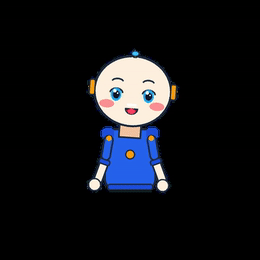
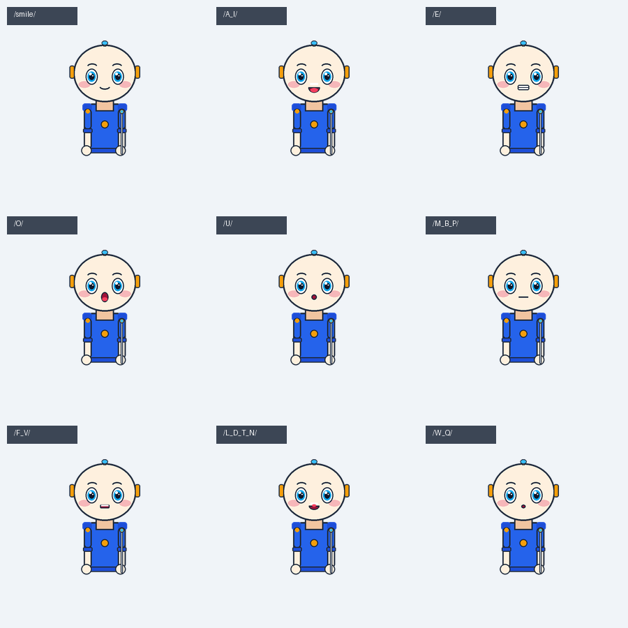
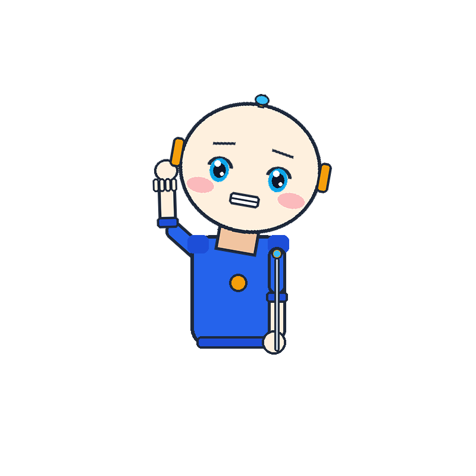
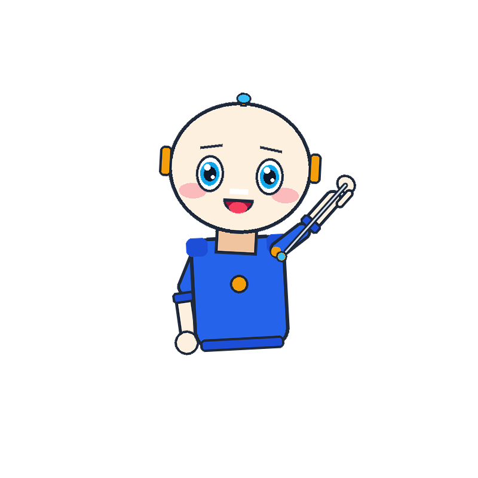
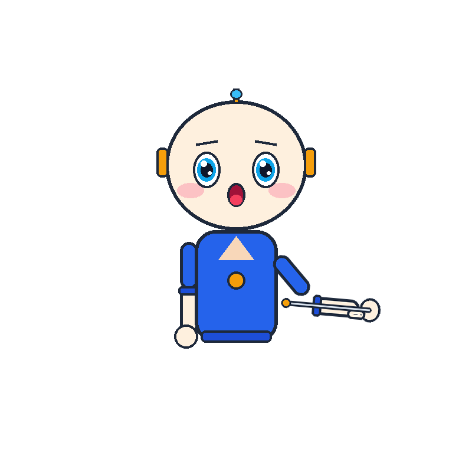
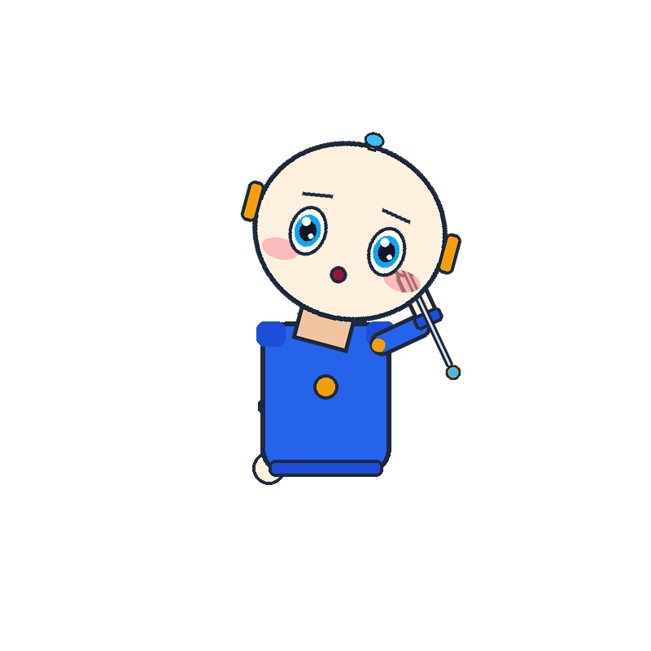

# VideoMascot 🎭

A modular, scalable, test-driven, AI-ready layered puppet and mascot animation engine designed for automated video pipelines (faceless channels, explainer videos, educational content).

---

## 🎬 Visual Demos & Previews

### 1. In-Memory Video Overlay Demo
*Shows the mascot gesturing with a pointer stick and speaking via 9-viseme lip-sync, streamed in-memory over a background scene via FFmpeg.*

| In-Memory Streaming Overlay Demo | Standalone Transparent Alpha Stream |
| :---: | :---: |
|  |  |
| [Download Full MP4 (`preview/demo_overlay.mp4`)](preview/demo_overlay.mp4) | [Download Transparent WebM (`preview/demo_mascot_alpha.webm`)](preview/demo_mascot_alpha.webm) |

---

### 2. Preston Blair 9-Viseme Speech Lip-Sync Set
*Real-time speech synchronization mapping phonetic timestamps and WebVTT subtitles.*



---

### 3. Kinematic Gesture & Expression Gallery
*Analytical 2-joint Forward & Inverse Kinematics (`solve_pointing_fk`, `solve_2joint_ik`) with modular props.*

| Cheerful Wave | Point Up-Right (With Prop) | Thumbs Up | Thinking Pose |
| :---: | :---: | :---: | :---: |
|  |  |  |  |

---

## 🌟 Key Features

- **100% Background-less Alpha Canvas**: Pure transparent RGBA rendering with zero bounding box artifacts.
- **Layered 2.5D Sprite Puppet Rig**: High-fidelity character models composed of modular slots (Head, Eyes, Pupils, Eyebrows, Viseme Mouths, Body, Limbs, Props).
- **Universal Kinematic Hierarchy**: 3x3 affine matrix propagation with analytical 2-joint Forward & Inverse Kinematics (`solve_2joint_ik`, `solve_pointing_fk`).
- **Standard 9-Viseme Lip-Sync (Preston Blair Set)**: Real-time mouth shaping for speech synchronization (`rest`, `smile`, `open_smile`, `A_I`, `E`, `O`, `U`, `M_B_P`, `F_V`, `L_D_T_N`, `W_Q`).
- **Continuous Procedural Life Layer**: Sinusoidal torso breathing, Poisson-distributed natural eye blinks, and saccadic pupil gaze tracking.
- **In-Memory Zero-Disk Streaming Engine**: Directly streams raw uncompressed RGBA pixel buffers to FFmpeg subprocess pipes in constant $O(1)$ memory without writing intermediate PNG files to disk.
- **Declarative Pydantic Schema**: Direct support for YAML/JSON directives (emotions, gestures, placements, props).
- **Standalone Alpha Video Exporters**: Export transparent videos to WebM VP9 (`yuva420p`) or Apple ProRes 4444 (`yuva444p10le`).
- **Interactive Live Web Inspector**: Standalone single-file HTML5/Canvas preview tool (`preview/inspector.html`) to test joint angles, visemes, and poses live in your browser.

---

## 🚀 Quickstart

### Installation

```bash
# Clone the repository
git clone https://github.com/theGoodB0rg/VideoMascot.git
cd VideoMascot

# Install in editable mode with development dependencies
pip install -e ".[dev]"
```

### Running Tests (100% Green Test-Driven Suite)

```bash
pytest tests/ -v
```

### Generating Sample Poses, Demos & Live Inspector

```bash
# Generate static poses & web inspector
python preview_poses.py

# Generate in-memory animated streaming overlay & transparent WebM/GIFs
python preview_stream.py
```

### Launching the Live Web Inspector

Open `preview/inspector.html` in any modern web browser to interact with joint angles, visemes, and expressions live.

---

## 📐 Architecture Overview

```
src/videomascot/
├── core/
│   ├── math_2d.py           # 2D Vectors, Transform matrices, Easing functions
│   ├── bones.py             # Bone hierarchy, 2-joint IK/FK solvers
│   └── slots.py             # Modular slot attachment management
├── models/
│   ├── manifest.py          # Pydantic schemas for MascotManifest & configs
│   ├── pose.py              # Runtime PoseState & joint definitions
│   └── schema.py            # Declarative action, placement, and speech cue schemas
├── animation/
│   ├── procedural.py        # Breathing oscillation, Poisson eye blinks, saccades
│   ├── lipsync.py           # VTT and timestamped 9-viseme lip-sync engine
│   └── sequencer.py         # Kinematic gesture sequencer & pose interpolation
├── compositor/
│   ├── sprite_engine.py     # Multi-layer alpha sprite compositor
│   └── stream_engine.py     # In-memory raw RGBA stream frame generator
├── pipeline/
│   └── video_overlay.py     # Direct FFmpeg subprocess streaming video compositor
├── assets/
│   └── starter_mascot.py    # Starter asset bundle generator (Chibi Tech Guide)
├── inspector_builder.py     # Standalone HTML5 inspector builder
└── engine.py                # High-level MascotEngine facade
```

---

## 💡 Consumer Usage Example (e.g. inside `video-pipe`)

```python
from videomascot import MascotEngine, VideoOverlayCompositor, MascotActionSchema, MascotPlacementSchema

# 1. Initialize engine from mascot bundle directory
engine = MascotEngine.from_bundle_dir("assets/mascots/chibi_tech_guide")

# 2. Configure action declaratively (or deserialize from story.json/story.yaml)
action = MascotActionSchema(
    emotion="excited",
    gesture="point_up_left",
    gaze="point_target",
    prop="pointer_stick",
    placement=MascotPlacementSchema(anchor="bottom_right", scale=0.45)
)

# 3. Stream uncompressed RGBA bytes directly into FFmpeg stdin pipe (Zero Disk I/O)
for frame_bytes in engine.stream_scene(action=action, duration=4.5, fps=24):
    ffmpeg_process.stdin.write(frame_bytes)

# Or overlay directly onto an existing background video file in one call
compositor = VideoOverlayCompositor(engine=engine)
compositor.overlay_onto_video(
    input_video="scene_bg.mp4",
    output_video="scene_with_mascot.mp4",
    action=action
)
```

---

## License

MIT
